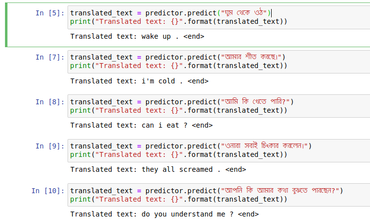

# BanglaTranslator
Translate bangla to english. This model is train based on encoder decoder with attention mechanism. This repository may be a starting point to approaching `bangla machine translation` problem. If this repository helps others people who are working on bangla machine translation then it would be very greatfull for me.

## Dataset
I use dataset provide in [http://www.manythings.org/anki/ben-eng.zip](http://www.manythings.org/anki/ben-eng.zip) . This dataset contain english bangla sentence pair in the following format,

```
I'm counting on you.	আমি আপনার উপর নির্ভর করে আছি।
I want your opinion.	আমি আপনার মতামত চাই।
How is your daughter?	আপনার মেয়ে কেমন আছে?
```

## Project structure
```
BanglaTranslator
├── assets
│   └── banglafonts
│       └── Siyamrupali.ttf
├── data
│   ├── ben-eng
│   │   ├── _about.txt
│   │   └── ben.txt
├── docs
│   └── U0980.pdf
├── models
│   ├── input_language_tokenizer.json
│   ├── target_language_tokenizer.json
├── translator
│   ├── config.py
│   ├── datasets.py
│   ├── infer.py
│   ├── __init__.py
│   ├── models.py
│   ├── train.py
│   └── utils.py
├── infer-example.ipynb
├── README.md
└── training-example.ipynb
```
- `assets` contain bangla font that used in plotting
- `data` contain english bangla pair dataset
- `docs` contrain documeantaion bangla unicode poins and it's char maping
- `models` contrain saved tokenize and training checkpoints if you do training
- `translator` is the core of the project that contrain all the required scripts for this project.
- `infer-example.ipynb` An example notebook that shows how predict on single sentence using saved checkpoints
- `training-example.ipynb` you can use this notebook to train bangla to english translator model

## Dependency
```
python 3.7
tensorflow 2.x
matplotlib
sklearn
tqdm
jupyter notebook
```

## Pre-train model
If you want to just test the model then you need to download pretrain model from from [google drive link ](https://drive.google.com/file/d/1UNI71ueT0sxfBax6DwW_XPy6YFq0ssTW/view?usp=sharing)
and extract `training_checkpoints.zip` file under `models` directory

## Test result
I test pre-train model and got result like bellow.



* If you want to test it yourself please check `infer-example.ipynb` and also download pre-train model

## Resources
- [unicode.org](http://www.unicode.org/charts/)
- [Bangla Alphabet](https://github.com/lifeparticle/Bengali-Alphabet)
- [Teacher forcing](https://towardsdatascience.com/what-is-teacher-forcing-3da6217fed1c)
- [Teacher forcing for RNN](https://machinelearningmastery.com/teacher-forcing-for-recurrent-neural-networks/)
- [Attention machanism](https://blog.floydhub.com/attention-mechanism/)
- [Neural machine translation with attention](https://www.tensorflow.org/tutorials/text/nmt_with_attention)
